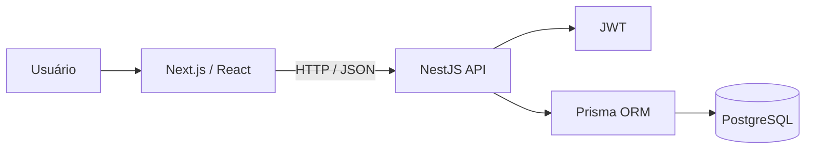
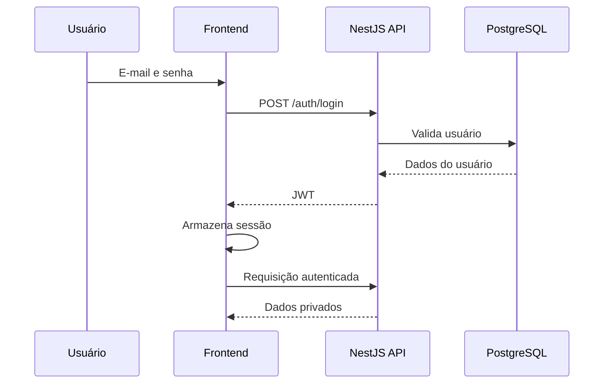
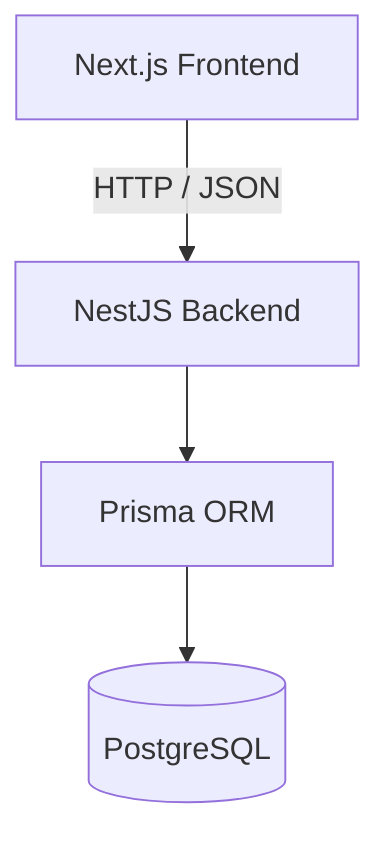
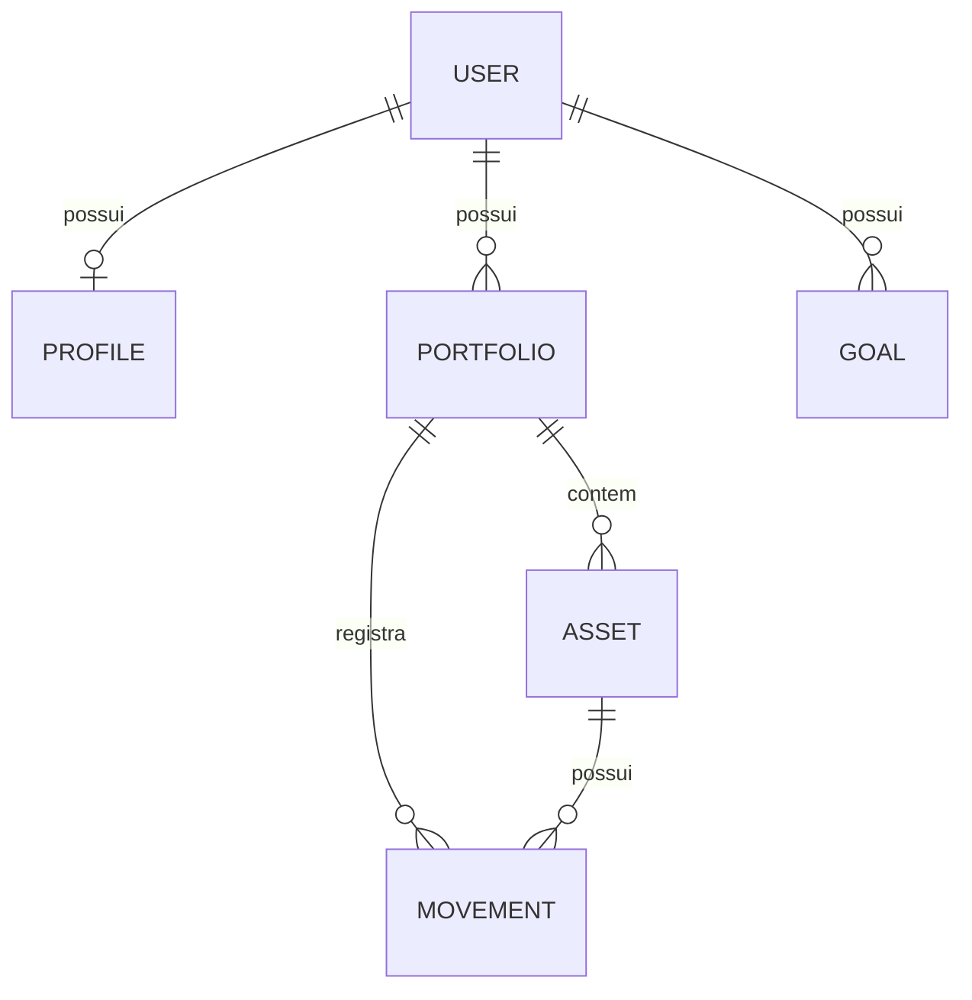
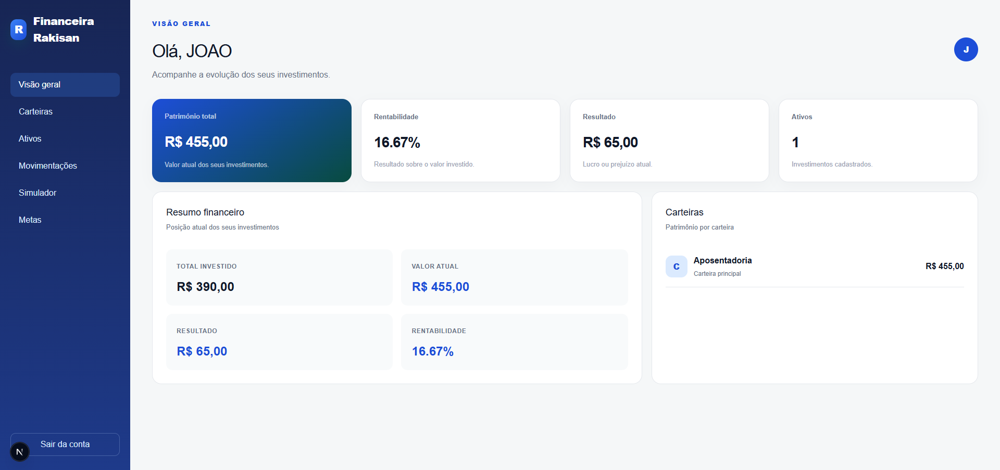
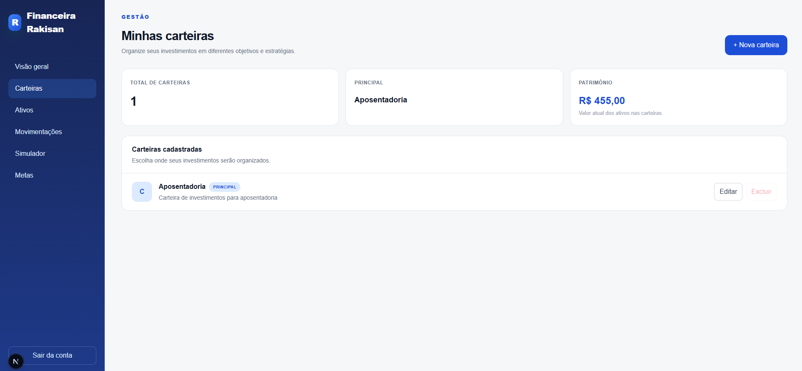
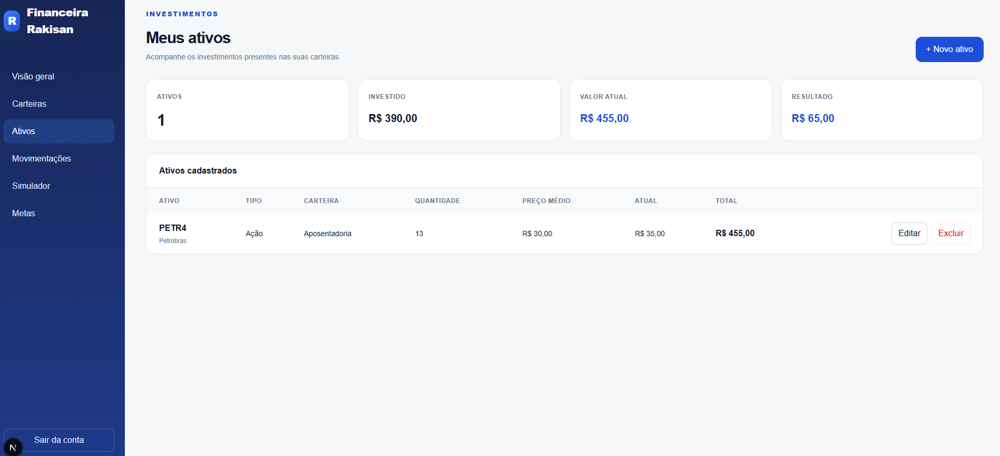
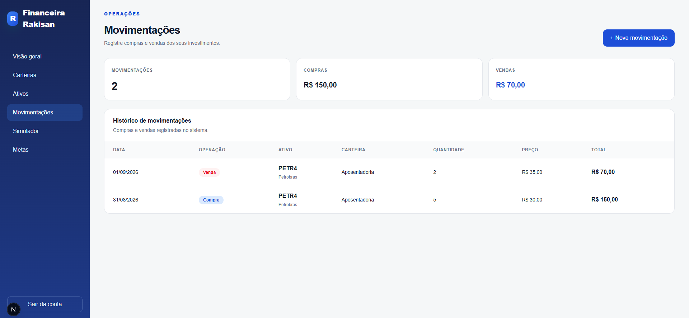
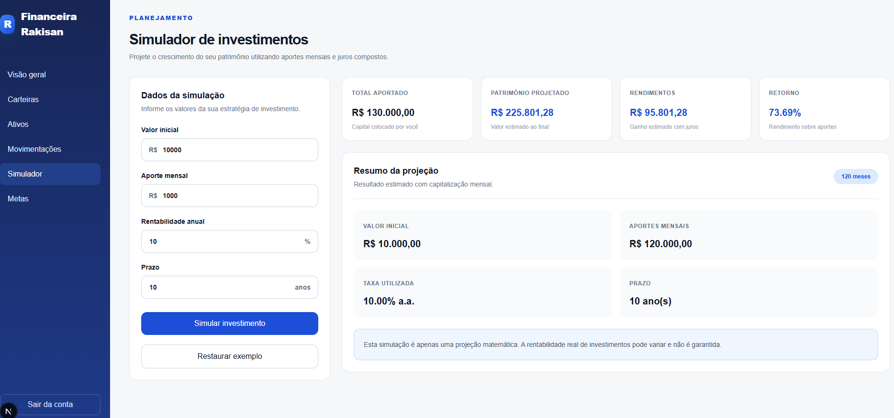
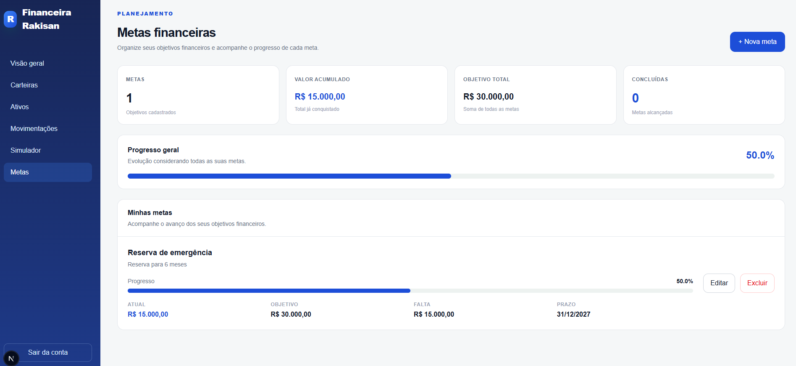

# 💰 Financeira Rakisan

<p align="center">
  <strong>Plataforma full stack para gestão, acompanhamento e simulação de investimentos pessoais.</strong>
</p>

<p align="center">
  
  
  
  
  
  
</p>

---

## 📌 Sobre o projeto

A **Financeira Rakisan** é uma aplicação full stack desenvolvida para gerenciamento de investimentos pessoais.

O sistema permite organizar carteiras, cadastrar ativos, registrar operações de compra e venda, acompanhar patrimônio e rentabilidade, realizar projeções financeiras e controlar metas de longo prazo.

O projeto foi criado com foco na aplicação prática de conceitos utilizados em sistemas reais, incluindo:

- APIs REST
- Autenticação JWT
- Regras de negócio
- Persistência de dados
- Relacionamentos entre entidades
- Validação de dados
- Integração frontend e backend
- Containers com Docker
- Migrations de banco de dados
- Organização de uma aplicação full stack

> **Projeto desenvolvido para fins educacionais e de portfólio. A Financeira Rakisan não representa uma instituição financeira real e não oferece recomendações de investimento.**

---

## ✨ Principais funcionalidades

### 🔐 Autenticação

O sistema possui autenticação própria para manter os dados de cada usuário isolados.

Funcionalidades:

- Cadastro de usuários
- Login com e-mail e senha
- Autenticação utilizando JWT
- Proteção das rotas privadas da API
- Identificação do usuário autenticado
- Separação dos dados por usuário
- Logout da aplicação

---

### 📊 Dashboard

O dashboard apresenta uma visão consolidada da posição financeira atual.

Informações exibidas:

- Patrimônio total
- Total investido
- Resultado financeiro
- Rentabilidade
- Quantidade de ativos
- Patrimônio por carteira

Os valores são calculados a partir dos ativos cadastrados pelo usuário.

---

### 💼 Carteiras

As carteiras permitem separar investimentos por estratégia ou objetivo.

Exemplos:

- Aposentadoria
- Reserva de emergência
- Longo prazo
- Renda passiva

Funcionalidades:

- Criar carteira
- Editar carteira
- Excluir carteira
- Definir uma carteira como principal
- Alterar a carteira principal
- Proteção contra exclusão da carteira principal
- Visualizar patrimônio associado a cada carteira

---

### 📈 Ativos

O módulo de ativos permite controlar os investimentos presentes nas carteiras.

Funcionalidades:

- Criar ativo
- Editar ativo
- Excluir ativo
- Associar ativo a uma carteira
- Definir tipo do ativo
- Informar quantidade
- Controlar preço médio
- Informar preço atual
- Calcular valor investido
- Calcular valor atual
- Calcular lucro ou prejuízo

Categorias de ativos suportadas pelo sistema:

- Ações
- FIIs
- ETFs
- Renda fixa
- Criptomoedas
- Fundos
- Outros

> Os preços dos ativos são informados manualmente nesta versão. Uma integração automática com APIs de cotações está prevista como evolução futura.

---

### 🔄 Movimentações

O módulo de movimentações registra operações realizadas sobre os ativos.

Operações disponíveis:

- Compra
- Venda

#### Compra

Ao registrar uma compra, o sistema:

- Aumenta a quantidade do ativo
- Recalcula o preço médio
- Atualiza a posição financeira
- Registra a operação no histórico

#### Venda

Ao registrar uma venda, o sistema:

- Valida se existe quantidade suficiente
- Reduz a quantidade disponível
- Mantém o histórico da operação
- Atualiza a posição financeira

O módulo também apresenta:

- Quantidade total de movimentações
- Valor total de compras
- Valor total de vendas
- Histórico de operações
- Data da operação
- Quantidade negociada
- Preço da operação
- Valor total da movimentação

---

### 🧮 Simulador de investimentos

A aplicação possui um simulador para projeção de patrimônio utilizando juros compostos.

O usuário informa:

- Valor inicial
- Aporte mensal
- Rentabilidade anual
- Prazo em anos

O sistema calcula:

- Total aportado
- Patrimônio projetado
- Rendimentos estimados
- Percentual de retorno
- Quantidade total de meses

> O simulador apresenta apenas uma projeção matemática. Rentabilidades reais podem variar e não são garantidas.

---

### 🎯 Metas financeiras

O módulo de metas permite acompanhar objetivos financeiros de médio e longo prazo.

Funcionalidades:

- Criar meta
- Editar meta
- Excluir meta
- Informar valor objetivo
- Informar valor acumulado
- Definir data limite
- Calcular quanto falta para atingir a meta
- Calcular percentual de progresso
- Exibir barra de progresso
- Consolidar o progresso de todas as metas
- Identificar automaticamente metas concluídas

Exemplo:

```text
Reserva de emergência

Valor atual:    R$ 15.000,00
Objetivo:       R$ 30.000,00
Falta:          R$ 15.000,00
Progresso:      50%
Prazo:          31/12/2027
```

---

## 🖥️ Interface

A aplicação possui as seguintes telas:

- Login
- Cadastro
- Dashboard
- Carteiras
- Ativos
- Movimentações
- Simulador de investimentos
- Metas financeiras

A identidade visual utiliza tons de azul e uma interface baseada em cards, tabelas, modais e indicadores financeiros.

### Identidade

```text
[R] Financeira Rakisan
```

Paleta principal:

| Uso | Cor |
|---|---|
| Azul principal | `#1D4ED8` |
| Azul secundário | `#2563EB` |
| Azul escuro | `#1E3A8A` |
| Azul profundo | `#172554` |
| Azul claro | `#DBEAFE` |
| Fundo | `#F8FAFC` |

---

## 🛠️ Stack utilizada

### Frontend

- Next.js
- React
- TypeScript
- Tailwind CSS
- Fetch API
- `localStorage` para armazenamento da sessão

### Backend

- Node.js
- NestJS
- TypeScript
- JWT
- Guards
- DTOs
- class-validator
- class-transformer

### Banco de dados

- PostgreSQL
- Prisma ORM
- Prisma Client
- Prisma Migrations

### Infraestrutura e desenvolvimento

- Docker
- Docker Compose
- Git
- GitHub
- npm
- VS Code

---

## 🏗️ Arquitetura

O projeto utiliza uma arquitetura separada entre frontend, backend e banco de dados.



### Fluxo de autenticação



---

## 📁 Estrutura do projeto

```text
Financeira Rakisan
│
├── apps
│   │
│   ├── api
│   │   │
│   │   ├── prisma
│   │   │   ├── migrations
│   │   │   └── schema.prisma
│   │   │
│   │   └── src
│   │       ├── assets
│   │       ├── auth
│   │       ├── generated
│   │       ├── goals
│   │       ├── health
│   │       ├── movements
│   │       ├── portfolios
│   │       ├── prisma
│   │       └── users
│   │
│   └── web
│       └── src
│           │
│           ├── app
│           │   ├── ativos
│           │   ├── cadastro
│           │   ├── carteiras
│           │   ├── dashboard
│           │   ├── login
│           │   ├── metas
│           │   ├── movimentacoes
│           │   └── simulador
│           │
│           ├── components
│           └── lib
│
├── docker-compose.yml
├── package.json
├── package-lock.json
├── roadmap.md
└── README.md
```

---

## 🔗 Fluxo da aplicação



O frontend é responsável pela interface e interação com o usuário.

O backend concentra:

- Autenticação
- Validações
- Regras de negócio
- Controle de acesso
- Operações financeiras
- Comunicação com o banco

O Prisma realiza a comunicação entre o backend e o PostgreSQL.

---

## 🗄️ Modelo de dados

Entre as principais entidades estão:



Principais entidades:

### User

Representa o usuário da plataforma.

### Profile

Armazena informações complementares do usuário.

### Portfolio

Representa uma carteira de investimentos.

### Asset

Representa um ativo presente em uma carteira.

### Movement

Representa uma operação de compra ou venda.

### Goal

Representa uma meta financeira do usuário.

---

## 🔒 Segurança

O projeto implementa diferentes mecanismos de proteção.

### Autenticação JWT

Após o login, a API gera um token JWT utilizado nas requisições protegidas.

### Guards

As rotas privadas do NestJS utilizam Guards para validar o token enviado pelo frontend.

### Isolamento dos dados

Os recursos são vinculados ao usuário autenticado para impedir acesso aos dados de outros usuários.

### DTOs e validação

As entradas da API são validadas antes do processamento.

### Variáveis de ambiente

Informações sensíveis ficam em arquivos `.env`, que não devem ser versionados no Git.

---

## 📡 API

A API é executada localmente em:

```text
http://localhost:3001
```

### Autenticação

```http
POST /auth/login
GET  /auth/me
```

### Usuários

```http
POST /users
GET  /users
```

### Carteiras

```http
GET    /portfolios
POST   /portfolios
PATCH  /portfolios/:id
DELETE /portfolios/:id
PATCH  /portfolios/:id/default
```

### Ativos

```http
GET    /assets
POST   /assets
PATCH  /assets/:id
DELETE /assets/:id
```

### Movimentações

```http
GET  /movements
POST /movements
```

### Metas financeiras

```http
GET    /goals
GET    /goals/:id
POST   /goals
PATCH  /goals/:id
DELETE /goals/:id
```

---

# ⚙️ Como executar localmente

## Pré-requisitos

Instale:

- Git
- Node.js
- npm
- Docker
- Docker Compose

---

## 1. Clonar o projeto

```bash
git clone https://github.com/guilhermesilva8989-ai/sistema-de-gestao-finaceira.git
```

Entre na pasta:

```bash
cd sistema-de-gestao-finaceira
```

---

## 2. Instalar dependências

Na raiz:

```bash
npm install
```

Caso seja necessário instalar separadamente:

### Backend

```bash
cd apps/api
npm install
```

### Frontend

```bash
cd apps/web
npm install
```

---

## 3. Configurar variáveis de ambiente

Utilize os arquivos `.env.example` como referência.

Nunca envie para o GitHub:

- Senhas
- Tokens
- JWT secrets
- URLs privadas
- Credenciais de banco

---

## 4. Iniciar o PostgreSQL

Na raiz do projeto:

```bash
docker compose up -d
```

Verifique:

```bash
docker compose ps
```

No ambiente local deste projeto, o PostgreSQL é exposto pela porta:

```text
5433
```

---

## 5. Preparar o banco de dados

Abra um terminal para o backend:

```bash
cd apps/api
```

Valide o schema:

```bash
npx prisma validate
```

Gere o Prisma Client:

```bash
npx prisma generate
```

Execute as migrations:

```bash
npx prisma migrate dev
```

---

## 6. Executar o backend

### Terminal 1 — API

Entre em:

```bash
cd apps/api
```

Execute:

```bash
npm run start:dev
```

Backend:

```text
http://localhost:3001
```

> Deixe este terminal aberto enquanto estiver utilizando a aplicação.

---

## 7. Executar o frontend

Abra um **segundo terminal**.

### Terminal 2 — Frontend

Entre em:

```bash
cd apps/web
```

Execute:

```bash
npm run dev
```

Frontend:

```text
http://localhost:3000
```

> Deixe este terminal aberto enquanto estiver utilizando a aplicação.

---

## 🐳 Ambiente com Docker

O PostgreSQL da aplicação é executado através do Docker Compose.

Comandos úteis:

### Iniciar

```bash
docker compose up -d
```

### Verificar status

```bash
docker compose ps
```

### Parar

```bash
docker compose down
```

### Ver logs

```bash
docker compose logs
```

---

## 🧪 Build de produção

Antes de publicar uma nova versão, é possível validar as duas aplicações.

### Backend

```bash
cd apps/api
npm run build
```

### Frontend

```bash
cd apps/web
npm run build
```

Os dois projetos devem finalizar a build sem erros.

---

## ✅ Regras de negócio implementadas

Além dos CRUDs básicos, o projeto implementa regras como:

- Cada usuário acessa apenas os próprios dados
- Apenas uma carteira pode ser considerada principal
- A carteira principal não pode ser excluída diretamente
- Compras aumentam a posição do ativo
- Compras recalculam o preço médio
- Vendas diminuem a quantidade disponível
- Não é possível vender quantidade superior à posição existente
- Movimentações permanecem registradas no histórico
- Patrimônio é calculado com base no valor atual dos ativos
- Resultado financeiro é calculado a partir do valor investido e valor atual
- Metas calculam automaticamente o percentual atingido
- Metas atingidas podem ser identificadas como concluídas

---

## 🗺️ Roadmap

Possíveis evoluções futuras:

- [ ] Integração com APIs de cotações
- [ ] Atualização automática dos preços
- [ ] Gráfico de evolução patrimonial
- [ ] Gráfico de alocação por ativo
- [ ] Gráfico de alocação por carteira
- [ ] Histórico de rentabilidade
- [ ] Dividendos e proventos
- [ ] Eventos corporativos
- [ ] Importação de movimentações
- [ ] Exportação de dados para CSV
- [ ] Relatórios em PDF
- [ ] Recuperação de senha
- [ ] Confirmação de e-mail
- [ ] Refresh Token
- [ ] Testes unitários adicionais
- [ ] Testes de integração
- [ ] Testes end-to-end
- [ ] Documentação da API com Swagger/OpenAPI
- [ ] Deploy completo em produção

---

## 🧠 Conceitos aplicados

Durante o desenvolvimento foram praticados conceitos de:

### Backend

- REST APIs
- Controllers
- Services
- Modules
- Guards
- DTOs
- Validação
- Autenticação
- Autorização
- Regras de negócio

### Banco de dados

- Modelagem relacional
- Chaves estrangeiras
- Relacionamentos
- Índices
- Migrations
- ORM
- Persistência

### Frontend

- Componentização
- Estado
- Formulários
- Modais
- Consumo de API
- Sessão autenticada
- Navegação
- Feedback visual
- Layout responsivo

### Engenharia de software

- Separação de responsabilidades
- Organização em módulos
- Git
- Versionamento
- Build de produção
- Variáveis de ambiente
- Containers

---

## 🎯 Objetivo

O principal objetivo deste projeto é demonstrar a construção de uma aplicação full stack completa, partindo da modelagem do banco até a interface final.

O projeto inclui comunicação entre:

```text
Frontend
    ↓
API REST
    ↓
Regras de negócio
    ↓
ORM
    ↓
Banco de dados
```

Diferentemente de um projeto puramente visual, a aplicação possui persistência real, autenticação, operações financeiras, regras de negócio e relacionamentos entre entidades.

---

## 🚀 Status

```text
✅ Autenticação
✅ Dashboard
✅ Carteiras
✅ Ativos
✅ Movimentações
✅ Compra e venda
✅ Simulador
✅ Metas financeiras
✅ PostgreSQL
✅ Prisma
✅ Docker
✅ Build do backend
✅ Build do frontend

✅ Screenshots
🔄 Deploy
```

---

## 👨‍💻 Autor

**Guilherme Silva**

Desenvolvido como projeto de estudo e portfólio em desenvolvimento full stack.

GitHub:

https://github.com/guilhermesilva8989-ai

---

## ⭐ Projeto de portfólio

Se você chegou até este repositório através do meu portfólio ou perfil profissional, fique à vontade para explorar o código e a arquitetura do projeto.

Sugestões, feedbacks e contribuições são bem-vindos.

---

## 📄 Aviso

Este software foi desenvolvido para fins educacionais e de demonstração técnica.

A **Financeira Rakisan não é uma instituição financeira** e os cálculos apresentados pela aplicação não constituem recomendação ou garantia de investimento.

---

## 📸 Screenshots

### 📊 Dashboard



### 💼 Carteiras



### 📈 Ativos



### 🔄 Movimentações



### 🧮 Simulador de investimentos



### 🎯 Metas financeiras



